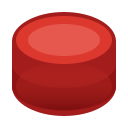

# Redis Radar

  

  <h3><strong>A Professional, Lightweight Redis Client for VS Code</strong></h3>
  
Manage connections, explore keys, and visualize data directly from your editor.

 

  
  
  

---

## 🚀 Features

Redis Radar brings a full-featured Redis GUI right into VS Code, designed for developers who want speed and efficiency.

### 🔌 Connection Management

- **Multiple Profiles**: Manage unlimited local and remote Redis connections.
- **Secure**: Support for password authentication and clean profile management.
- **Status Indicators**: Instant visual feedback on connection health.

### 🔍 Smart Explorer

- **Lazy Loading**: Efficiently handles databases with thousands of keys.
- **Quick Search**: Filter keys instantly using glob patterns (e.g., `user:*`).
- **Rich Visualization**: Icons differentiate key types (String, List, Set, Hash, etc.).

### 📝 Data Viewer

- **JSON Pretty-Print**: Automatically formats JSON values for readability.
- **Type Inspection**: View key TTL, type, and size at a glance.
- **Clipboard Support**: One-click copy for keys and values.

### ⚡ Quick Actions

- **Inline Controls**: Connect, disconnect, and delete directly from the sidebar.
- **Flush DB**: Safely clear databases with a dedicated command.
- **Key Management**: Delete individual keys effortlessly.

---

## 🛠️ Getting Started

1. **Open Redis Radar**: Click the Redis icon in the Activity Bar.
2. **Add Connection**:
   - Click the `+` button.
   - Enter a name (e.g., "Local"), Host (`localhost`), and Port (`6379`).
   - Click **Save**.
3. **Connect**: Click the **Play** button on your new profile.
4. **Explore**: Expand the connection to view and interact with your Redis keys.

---

## ⚙️ Requirements

- **VS Code**: v1.85.0 or higher.
- **Redis Server**: Local, Docker, or Cloud instance.

